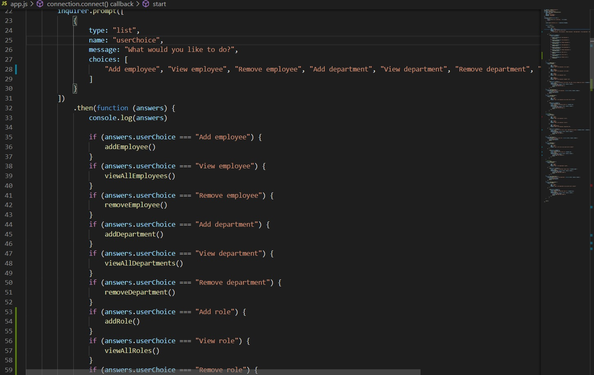
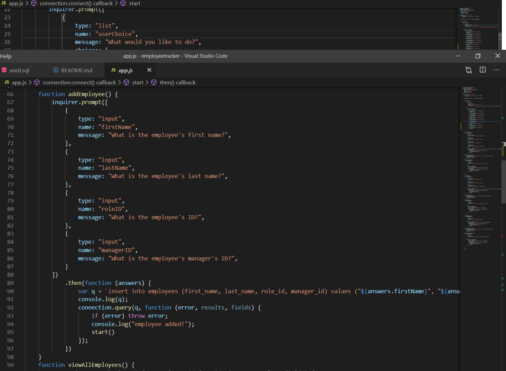
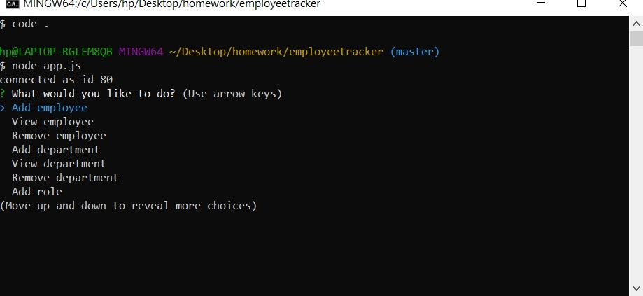
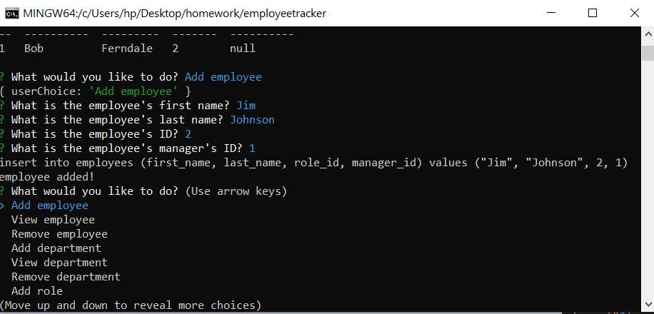
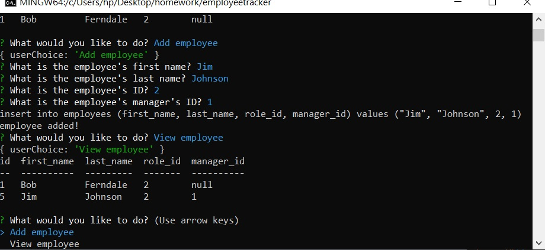
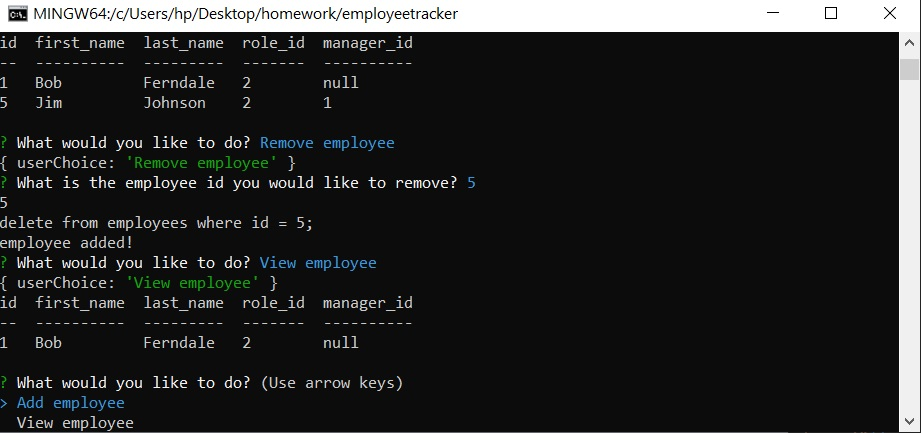

* Employee Tracker

<!-- Live link to deployed app -->
Repository: https://github.com/Mdudzik92/employeetracker
Deployed app: https://mdudzik92.github.io/employeetracker/

<!-- Technologies used -->
Node.js, inquirer, MySQL

<!-- Explanation of what the app is -->
This is an app which allows the user to view and manage the departments, roles, and employees in their company so that they can organize and plan their business.

<!-- Screenshot -->

<!-- License -->
MIT

<!-- Contact information -->
Email: mdudzik92@gmail.com